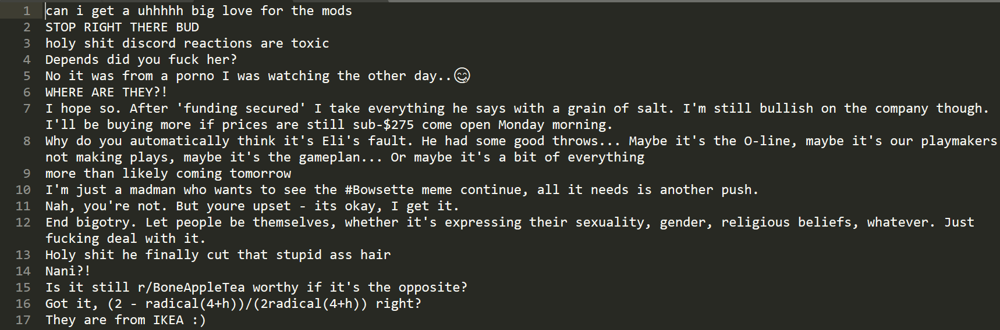
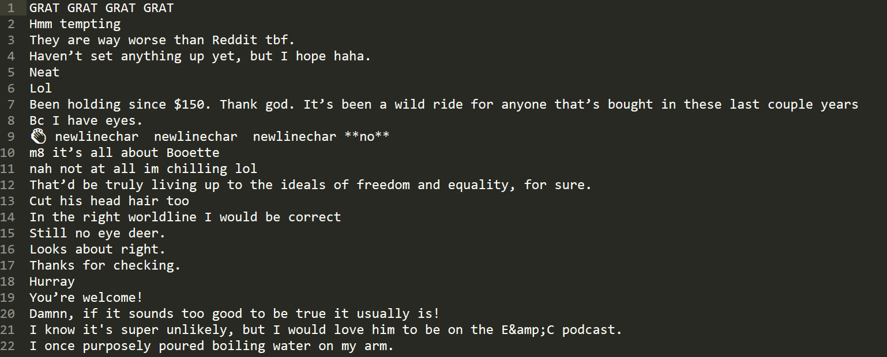
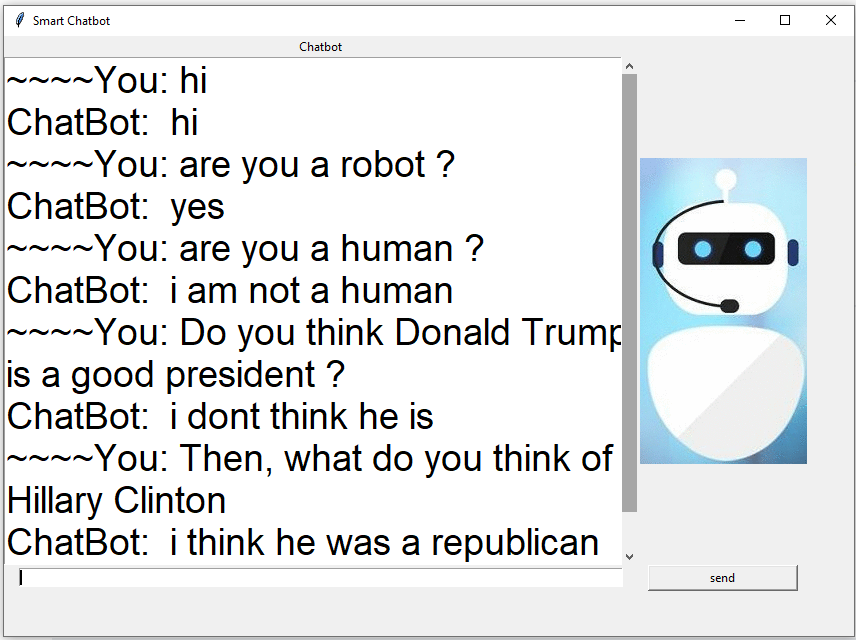

# Your_Chatbot

This is a chatbot model that you can bring you own datasets(conversations) to train the recurrent neural networks and tweak it around to get better outputs. There is a simple GUI(based on tkinter) included so that you can chat with your Chatbot easily and immersively.

## My Testing Enviroment

OS:  Windows 10 X64

Python Version:  3.5

Tensorflow-gpu Version:  1.9.0

CUDA:  9.0

## Prerequisites

Tensorflow-gpu    # pip install tensorflow-gpu

Numpy             # pip install numpy  

pandas            # pip install pandas

tkinter           # included in python distributions since python 3.1

## Datasets Preparation

I trained my version of chatbot using reddit comments which I downloaded it from the internet. They are huge files and i recommend you choose one month(one file) commemnts if you are gonna use this source, which i think its enough. 
Here is the link. [http://files.pushshift.io/reddit/comments/](http://files.pushshift.io/reddit/comments/)

Of course, you can use any datasets you want. Here is an example of what the data looks like after getting rid of the nuneccessary information and the final result of a GUI testing. There are questions and answers saved in two files.

### Questions data preview

### Answers data preview

### Final Result

## Implementation Procedures

This is an example of how this model works using reddit comment data(json format). If you are using other kind of data source you can try to make you own version of data cleaning program, as long as you can get the key information out.

Once you have your reddit comment(extracted) file ready. Here is how to train your own chatbot.

1. Open Data_Cleaning.py and put you path of your dataset after ''' data_dir = ''', then run Data_Cleaning.py, you should get a database file (data.db) in your working directory.

2. After you have build the database, run Get_Data.py, then you should get two files, they are questions and answers for training.

3. Third step is to train your model, open Train&Chat.py, check line 6, set the code to ' MODE = "train" ', then run Train&Chat.py. You can set all the configures within this file. Check the documentations.

4. Once the training is done. You'll get a checkpoint file in your working directory and that's the weights you need to make a prediction. Go back to Train&Chat.py, check line 6, change code to ' MODE = "chat" ', then run it. After a perid of loading, a GUI should pop up and you can start chatting with your bot to test it out.

## Authors

* **Hehe Zhao**

 [https://github.com/zhaohehe520/Your_Chatbot](https://github.com/zhaohehe520/Your_Chatbot)

## License

This project is licensed under the MIT License.

## Acknowledgments

This project is inspired by Magnus Erik Hvass Pedersen and sentdex, by the way, they make great tutorial videos on machine learning and all kinds of tech realated stuff, check their videos out by searching thier names on youtube.Or clik the link below

Hvass Laboratories :  [https://www.youtube.com/channel/UCbba38V6vcglqVL--8kVVmg](https://www.youtube.com/channel/UCbba38V6vcglqVL--8kVVmg)

sentdex : [https://www.youtube.com/channel/UCfzlCWGWYyIQ0aLC5w48gBQ](https://www.youtube.com/channel/UCfzlCWGWYyIQ0aLC5w48gBQ)